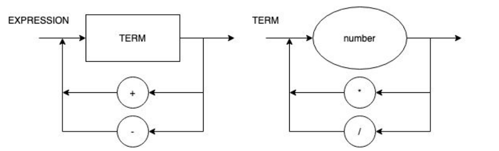

# Simple Calculator

Projeto individual de um compilador para a disciplina Lógica da Computação, do 7° semestre de engenharia de computação.


### Diagrama Sintático (v1.1)



### EBNF (v1.1)

```
EXPRESSION = TERM, {("+" | "-" ), TERM} ;
TERM = NUMBER, {("*" | "/"), NUMBER} ;
NUMBER = DIGIT, {DIGIT} ;
DIGIT = 0 | 1 | ... | 9 ;
```

### Operando com tags

Para criar uma nova tag:

```bash
git tag -a v0.1.1 -m "Mensagem sobre o release"
git push origin v0.1.1
```

Para selecionar a versão (note que não é um branch):
```bash
git checkout v0.1.1
```

