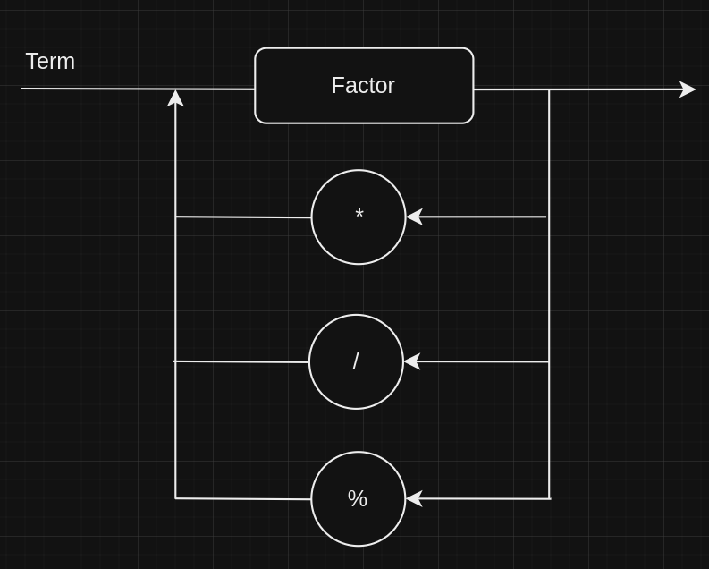

# Go Compiler

Projeto individual de um compilador para a disciplina Lógica da Computação, do 7° semestre de engenharia de computação. C

### Adicionando resto de divisão

Só é necessário mudar o Factor

Passos para aplicação:

No Tokenizer:
 - Se for %, criar Token INC

Em nodes:
 - Em BinOp, se value = %, evaluate = children[0] % children[1]

No parser:
 - No método parse_term()
 - depois de achar factor
 - while next_value = * ou / ou %
    - se %
        - new_factor = parse_factor()
        - BinOp(value = %, [factor, new_factor])
