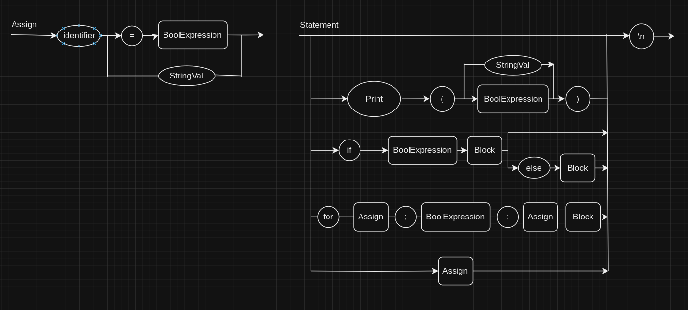

# Go Compiler

Projeto individual de um compilador para a disciplina Lógica da Computação, do 7° semestre de engenharia de computação.

<<<<<<< HEAD
### Adicionando operação de incrementa no compilador

Só é necessário mudar o Assign

Passos para aplicação:

No Tokenizer:
    - Toda vez que tiver um +, ver se é uma adição ou um incrementa
    - Se for incrementa, criar Token INC

Em nodes:
    - Não precisa fazer nada

No parser:
    - No método parse_assign:
        > depois de achar identifier
        > se tiver um + e depois outro +
            > consumir o Token
            > Criar um nó IntVal(value = '1', children = [])
            > Criar um nó BinOp(value = '+', children = [nó IntVal, nó Identifier])
            > retornar nó Assignment(value = None, children = [nó identifier, nó BinOp])
        > caso contrário, seguir como anteriormente