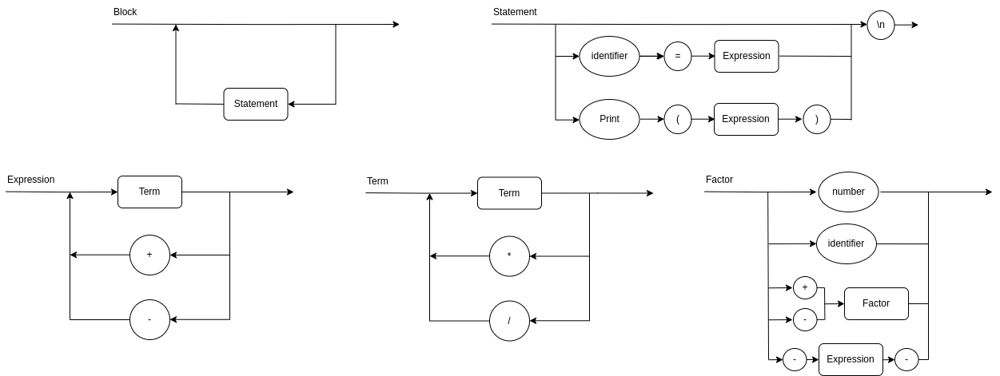

# Roteiro 1

### Tarefas do Roteiro:

1. Colocar o Diagrama Sintático no GitHub.
2. Criar uma Classe Token com 2 atributos:
   - type: string. tipo do token
   - value: integer. valor do token
3. Criar uma Classe Tokenizer com 3 atributos e 1 método:
   - source: string. código-fonte que será tokenizado
   - position: integer. posição atual que o Tokenizador está separando
   - next: Token. o último token separado
   - selectNext(): lê o próximo token e atualiza o atributo next
4. Criar uma Classe Parser com 1 atributo e 2 métodos (Sugestão: criar estáticos):
   - tokenizer: Tokenizer. Objeto da classe que irá ler o código fonte e alimentar o Analisador.
   - parseExpression(): consome os tokens do Tokenizer e analisa se a sintaxe está aderente à gramática proposta. retorna o resultado da expressão analisada.
   - run(code): recebe o código fonte como argumento, inicializa um objeto Tokenizador, posiciona no primeiro token e retorna o resultado do parseExpression(). Ao final verificar se terminou de consumir toda a cadeia (o token deve ser EOF).
5. O main() do compilador deve chamar o método Parser.run()

### Diagrama Sintático (v1.0)



### Rodando o Programa

``` bash
python main.py '1+1'
```

**Base de Testes**:
```bash
>> 1+2
>> 3-2
>> 1+2-3
>> 11+22-33
>> 789 +345 - 123
```


