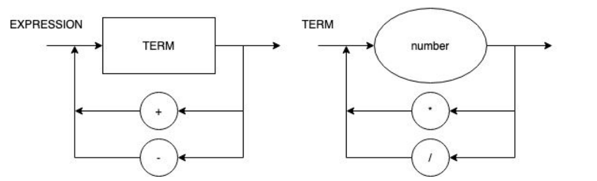

# Roteiro 1

### Objetivos do Roteiro
1. Implementar operação de MULT e DIV.
2. Ignorar comentários.

### Tarefas do Roteiro:
1. Atualizar o Diagrama Sintático e a EBNF no GitHub.
2. Implementar as melhorias conforme o DS atualizado.
3. Prestar muita atenção nos lugares onde será necessário alterar.

### Diagrama Sintático (v1.2)



### EBNF

```
EXPRESSION = TERM, {("+" | "-" ), TERM} ;
TERM = NUMBER, {("*" | "/"), NUMBER} ;
NUMBER = DIGIT, {DIGIT} ;
DIGIT = 0 | 1 | ... | 9 ;
```

### Rodando o Programa

``` bash
python main.py '1+1'
```

**Base de Testes**:
```bash
Sem erros:
>> 3-2
>> 1
>> 11+22-33
>> 4/2+3
>> 3+4/2
```
```bash
Com erros:
>> +3
>> 3+
>>
>> 3*/ 3 +
```


