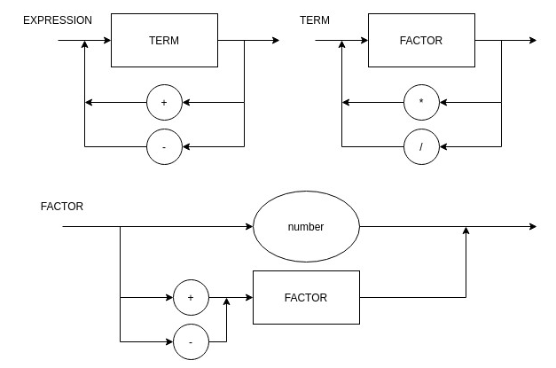

# Roteiro 4

### Objetivos do Roteiro
1. Implementar a árvore sintática abstrata (AST)

### Tarefas do Roteiro:
1. Fazer com que o compilador ignore os comentários. Crie uma classe `PrePro` com uma função `filter()` estática para remover os comentários. Use antes de carregar no Tokenizer.
2. Criar uma classe abstrata (ou interface) chamada `Node`, contendo os seguintes atributos e métodos:
 - `value: variant`
 - `children: list of nodes`
 - `Evaluate(): variant`
3. Criar as seguintes classes que herdam (ou implementam) a classe `Node`:
 - `BinOp - Binary Operation` - Contem 2 filhos
 - `UnOp - Unary Operation` - Contem um filho
 - `IntVal - Integer value` - Não contem filhos
 - `NoOp - No Operation (Dummy)` - Não contem filhos
Todas as classes acima devem retornar no método `Evaluate()` - via overriding - o valor correspondentes à operação de cada classe. Por Exemplo: `Evaluate()` do `IntVal` deve retornar o próprio valor inteiro, `Evaluate()` de `BinOp` deve retornar a operação dos seus dois filhos, etc.
4. Modificar o `Parser` para não mais interpretar a entrada e sim retornar a AST montada. Com isso cada função do `Parser` retorna um objeto do tipo `Node` (e não um valor). O responsável por executar cada função tem que se encarregar de montar a árvore e retornar o pŕoprio nó. Por Exemplo: a função `parseExpression` coleta a árvore resultante do parseTerm e monta o seu próprio nó conforme realiza o consumo dos tokens, retornando o seu nó ao final.
5. Quando o `main()`, de posse de toda a árvore montada, executar o método `Evaluate()` da raiz, este deverá executar recursivamente os seus filhos, obtendo ao final o valor interpretado.
6. Modificar o programa principal para ler um arquivo de extensão `.go` ao invés de ler a entrada do console.
Não travar a extensão no compilador.

### Diagrama Sintático (v2.0)



### EBNF

```
EXPRESSION = TERM, {("+" | "-" ), TERM} ;
TERM = NUMBER, {("*" | "/"), NUMBER} ;
NUMBER = DIGIT, {DIGIT} ;
DIGIT = 0 | 1 | ... | 9 ;
```

### Rodando o Programa

``` bash
python main.py entrada.go
```

**Base de Testes**:
```bash
Todos os testes dos roteiros anteriores
```


