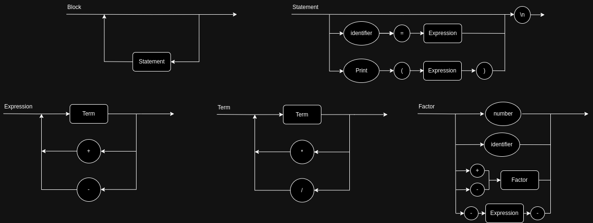

# Roteiro 5

### Objetivos do Roteiro
1. Implementar variáveis (identifier) e tabela de símbolos.
2. Implementar bloco de instruções.
3. Implementar print.

### Tarefas do Roteiro:
1. Atualizar o Diagrama Sintático e a EBNF no GitHub.
2. Implementar a classe `SymbolTable` com getter e setter para identificadores.
3. Alterar todos as funções `Evaluate()` para receber um objeto `SymbolTable` como argumento.
4. Criar um objeto `SymbolTable` na main e passar no `Evaluate` da raiz da AST.
5. Implementar as melhorias conforme o DS atualizado. Não esquecer de alterar:
 - `Tokenizer`
 - `Parser`
 - AST (`Nodes`)

### Diagrama Sintático (v2.1)



### EBNF

```
BLOCK = { STATEMENT };
STATEMENT = ( λ | ASSIGNMENT | PRINT), "\n" ;
ASSIGNMENT = IDENTIFIER, "=", EXPRESSION ;
PRINT = "Println", "(", EXPRESSION, ")" ;
EXPRESSION = TERM, { ("+" | "-"), TERM } ;
TERM = FACTOR, { ("*" | "/"), FACTOR } ;
FACTOR = (("+" | "-"), FACTOR) | NUMBER | "(", EXPRESSION, ")" | IDENTIFIER ;
IDENTIFIER = LETTER, { LETTER | DIGIT | "_" } ;
NUMBER = DIGIT, { DIGIT } ;
LETTER = ( a | ... | z | A | ... | Z ) ;
DIGIT = ( 1 | 2 | 3 | 4 | 5 | 6 | 7 | 8 | 9 | 0 ) ;
```

### Rodando o Programa

``` bash
python main.py entrada.go
```

**Base de Testes**:
```bash
Todos os testes dos roteiros anteriores
```


